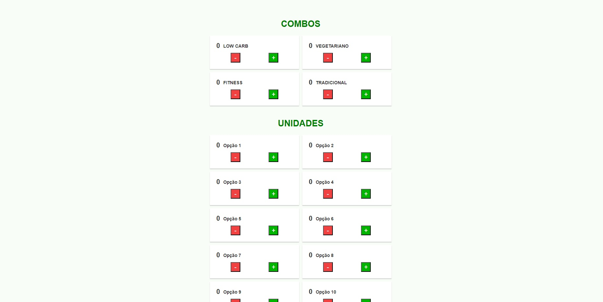

<h1 align="center" >Calculadora de marmitas - Guga Marmitas</h1>

Projeto para calcular a quantidade de comida necessária para facilitar na hora da compra.

## </> **Tecnologias usadas**

As principais tecnologias usadas nesse projeto:

`React`

`JavaScript`

`HTML`

`CSS`

## 📖 **Descrição do Projeto**

A cliente(minha mãe) tinha muito trabalho para calcular a quantidade de comida necessária para se comprar no mercado para cada pedido que tinha, então criei esse site para calcular automaticamente todas as marmitas de seu cardápio usando React, lhe poupando muito tempo.

## ? **Como usar**
1. Clonar o repositório: **`git clone https://github.com/gustavogularte/calculadora-marmitas.git`**
2. Instalar as dependências: **`npm install`**
3. Iniciar o aplicativo: **`npm run dev`**

## 🔗 **Links**

- Site - https://calcularmarmitas.netlify.app
- AS MELHORES MARMITAS AQUI - https://www.instagram.com/marmitas_guga/
- Linkedin - https://www.linkedin.com/in/gustavo-gularte-58742a286
- Meu Twitter - https://twitter.com/gustavoGulArend
- Meu perfil no Front End Mentor com mais desafios - https://www.frontendmentor.io/profile/gustavogularte